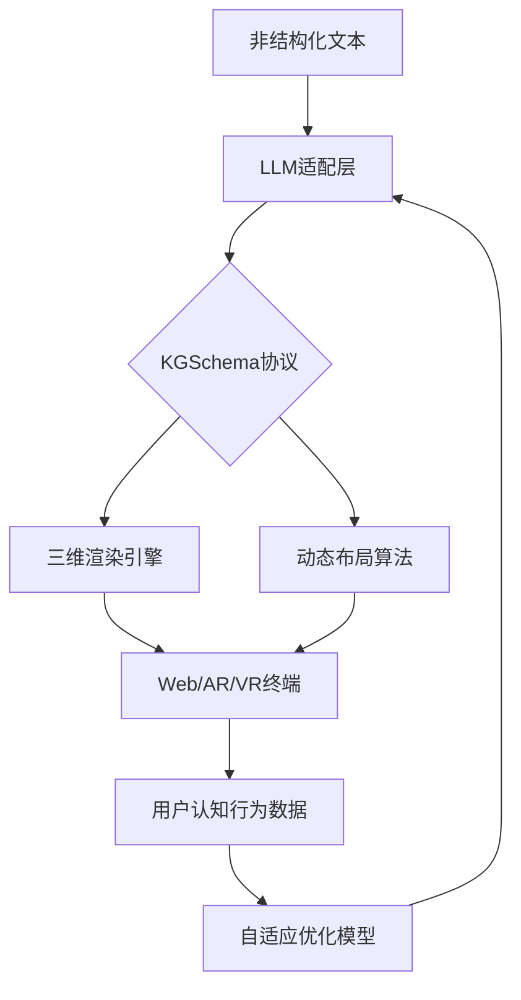
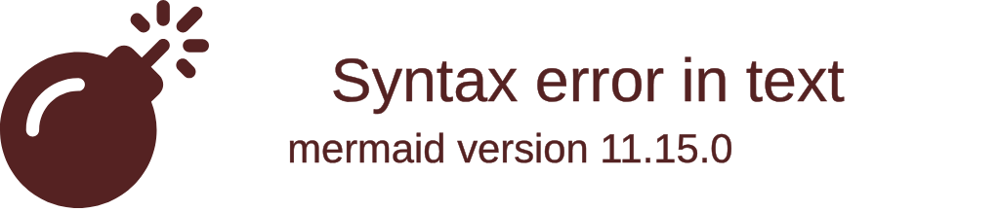

# KnowledgeCamera


## 🌟 项目愿景
我们致力于将LLM的黑盒知识转化为可交互、可解释的三维空间网络，让复杂信息的理解效率提升一个维度。

## 🚀 核心价值

三维图谱只需一行代码

## 🛠️ 技术架构



### 核心模块
| 模块 | 技术栈 | 状态 |
|------|--------|------|
| KGSchema协议 | JSON Schema + 语义校验 | Alpha |
| 三维渲染引擎 | Three.js + WebGPU | Dev |
| LLM适配器 | LangChain + OpenAI Function Calling | Beta |
| 布局算法库 | ForceAtlas2-WASM + GNN优化 | Design |

## 📌 快速开始
### 安装
```bash
npm install @kg3d/core
# 或
pip install kg3d-python-bridge
```

### 从文本到三维
```python
from kg3d import KGGenerator

# 连接LLM
generator = KGGenerator(llm_api="openai://chat-4")

# 生成三维图谱
schema = generator.generate(
    text="量子计算与人工智能的交叉进展...",
    template="academic" # 学术论文模板
)

# 在浏览器中查看
schema.preview()
```

### 开发者API
```javascript
import {KGRenderer} from '@kg3d/core';

const renderer = new KGRenderer('#container', {
    spatialRule: {
        time: { axis: 'z', format: 'YEAR' },
        semantic: { model: 'text-embedding-3-small' }
    }
});

renderer.loadSchema('https://example.com/kg/schema.json');
```

## 🛣️ 开发路线
- [x] KGSchema 1.0草案
- [ ] Three.js基础渲染器
- [ ] LangChain官方插件

## 🤝 如何贡献
### 代码规范
- **协议层**：所有扩展必须通过JSON Schema校验
- **可视化层**：遵循SPACE设计原则（Semantic-Preserving Adaptive Coordinate Encoding）
- **算法层**：提供WASM和纯JS双版本

### 分支管理



### 贡献流程
1. 在[Discussion](https://github.com/your-repo/discussions)发起提案
2. 签署CLA贡献者协议
3. 提交符合规范的PR（需包含交互测试用例）

## 📜 许可协议
- 核心引擎：[Apache 2.0](LICENSE)
- 企业扩展模块：商业授权
- 协议标准：[开放知识协议OKP](docs/OKP-1.0.md)

